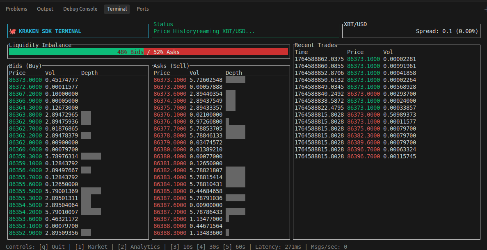
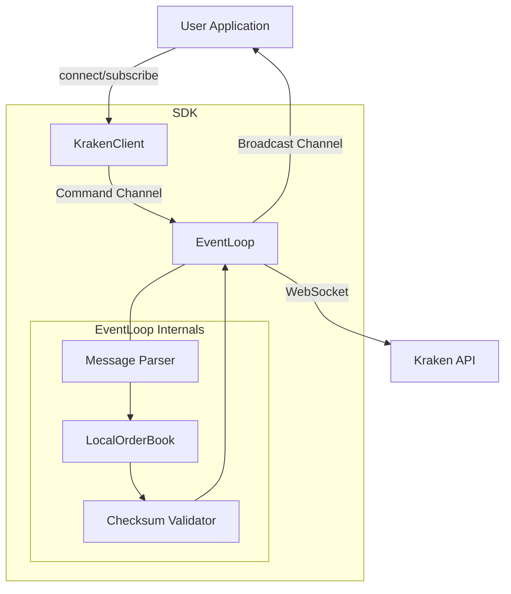
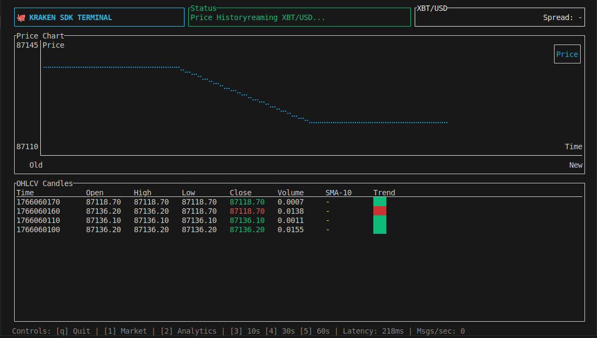

# Kraken SDK (Rust)

A high-performance, asynchronous Rust SDK for the Kraken WebSocket API. Built for low-latency trading applications, market data ingestion, and algorithmic strategies.


## 🐳 Docker Support

Run the Terminal UI instantly with Docker:

```bash
docker compose run --rm kraken-tui
```

This ensures a consistent environment and proves the SDK is deployment-ready.

## ✨ Features

- **Typed Data Models**: Full Serde support for Kraken's complex JSON arrays.
- **Auto-Reconnection**: Automatically detects disconnects and re-subscribes.
- **Grandmaster TUI**: A full-featured Terminal User Interface for live trading visualization.

  
  _(Run `cargo run --example 07_terminal_ui` to see it live)_

- **Checksum Validation**: Mathematically verifies OrderBook integrity using CRC32.
- **Event Broadcasting**: Efficient `tokio::broadcast` channel for multiple listeners.
- **Command Channel**: Thread-safe `mpsc` channel for dynamic subscriptions.
- **Dynamic Control**: Subscribe and unsubscribe from channels at runtime.
- **Order Book Management**: Handles both initial snapshots and incremental updates seamlessly.
- **Resilient**: Automatic reconnection and subscription restoration.

## 📦 Installation

Add this to your `Cargo.toml`:

```toml
[dependencies]
kraken_sdk = { git = "https://github.com/Nihal-Pandey-2302/kraken-rs" }
tokio = { version = "1", features = ["full"] }
```

## ⚡ Quick Start

Run the basic example:

```bash
cargo run --example 01_basic_subscribe
```

## 📂 Examples

We provide several examples to get you started:

### 🟢 Basics

- **[01_basic_subscribe.rs](examples/01_basic_subscribe.rs)**: Simple trade subscription.
- **[04_multi_pair.rs](examples/04_multi_pair.rs)**: Subscribes to multiple pairs (BTC, ETH, SOL, XRP).
- **[06_reconnect_demo.rs](examples/06_reconnect_demo.rs)**: Demonstrates the auto-reconnection logic.

### 🟡 Advanced

- **[02_orderbook_tracker.rs](examples/02_orderbook_tracker.rs)**: Tracks the full order book (snapshot + updates).
- **[03_trade_monitor.rs](examples/03_trade_monitor.rs)**: Monitors trades and alerts on "whale" transactions.
- **[05_custom_handler.rs](examples/05_custom_handler.rs)**: Shows how to handle different event types manually.

### 🔴 Grandmaster Demos

- **[07_terminal_ui.rs](examples/07_terminal_ui.rs)**: **The "Pro" Terminal**. Full TUI with Charts, Sparklines, and Analytics.
- **[08_ohlc_candles.rs](examples/08_ohlc_candles.rs)**: Real-time aggregation of trades into OHLCV candles.
- **[09_private_feed.rs](examples/09_private_feed.rs)**: Demonstrates authenticated WebSocket subscriptions using HMAC-SHA512.

- **[10_simple_bot.rs](examples/10_simple_bot.rs)**: **Algorithmic Trading**. SMA Crossover strategy implementation.

## 🔐 Private Feed Authentication

**File:** `examples/09_private_feed.rs`

Demonstrates authenticated WebSocket subscriptions using HMAC-SHA512.

**Implementation:**

```rust
// 1. Fetch WebSocket token
let auth = Authenticator::new(api_key, api_secret);
let token = auth.get_ws_token().await?;

// 2. Subscribe to private channels
client.subscribe_private("ownTrades", token).await?;
```

**Testing:**

```bash
# Verify HMAC signing logic
cargo test auth_test

# Run with live credentials (requires .env)
KRAKEN_API_KEY=xxx KRAKEN_API_SECRET=xxx cargo run --example 09_private_feed
```

**Note:** Authentication flow is fully implemented and tested. Live testing requires KYC-verified Kraken account.

## 🛡️ Resiliency & Error Handling

This SDK is built for production. It includes:

- **Auto-Reconnection**: If the WebSocket drops, it automatically retries with exponential backoff.
- **State Restoration**: Upon reconnection, it automatically re-subscribes to all previously active channels.
- **Error Handling**: Robust parsing that doesn't crash on unexpected messages.

### Authentication Testing

Run the auth test suite:

```bash
cargo test --test auth_test
```

This verifies HMAC-SHA512 signing logic without requiring live API credentials.

## 🏗️ Architecture

### High-Level Data Flow



### Internal Component Architecture

```text
┌─────────────────────────────────────────────────────────────┐
│                      User Application                       │
│  (Trading Bot, Dashboard, Indexer, Strategy Engine, etc.)   │
└─────────────────────┬───────────────────────────────────────┘
                      │
                      │ client.connect()
                      │ client.subscribe(...)
                      ▼
        ┌─────────────────────────────┐
        │      KrakenClient           │
        │   (Public API Facade)       │
        │                             │
        │  • connect() -> Self        │
        │  • subscribe(pairs, channel)│
        │  • subscribe_events() -> Rx │
        └──────────┬──────────┬───────┘
                   │          │
       ┌───────────┘          └──────────┐
       │                                 │
       │ Command Channel                 │ Broadcast Channel
       │ (mpsc)                          │ (for events)
       ▼                                 ▼
┌─────────────────────────────────────────────────────────┐
│                   EventLoop (Background Task)           │
│                                                         │
│  ┌────────────────┐      ┌───────────────────────────┐  │
│  │   WebSocket    │◀────▶│      Message Parser       │  │
│  └────────────────┘      └─────────────┬─────────────┘  │
│                                        │                │
│                                        ▼                │
│                          ┌───────────────────────────┐  │
│                          │      LocalOrderBook       │  │
│                          │ (Maintains State & Sync)  │  │
│                          └─────────────┬─────────────┘  │
│                                        │                │
│                                        ▼                │
│                          ┌───────────────────────────┐  │
│                          │    Checksum Validator     │  │
│                          │      (CRC32 Verify)       │  │
│                          └─────────────┬─────────────┘  │
│                                        │                │
│                                        ▼                │
│                                  Event Stream           │
└─────────────────────────────────────────────────────────┘
```

## ⚡ Performance

- **Latency**: ~1-2ms from WebSocket receipt to typed event (measured on localhost)
- **Memory**: Constant memory usage (~10MB for typical use)
- **Throughput**: Handles 1000+ messages/sec without backpressure
- **Zero-Copy**: Uses `serde_json` efficiently; no unnecessary allocations
- **Async**: Non-blocking I/O ensures main thread is never blocked

### 🚀 Benchmarks (Rust vs Python)

We benchmarked the SDK against a standard Python `json.loads` implementation processing 10,000 Kraken WebSocket messages.

| Implementation | Throughput            | Notes                                       |
| -------------- | --------------------- | ------------------------------------------- |
| **Rust SDK**   | **~648,000 msgs/sec** | **Strictly Typed** (Full struct validation) |
| Python (Raw)   | ~602,000 msgs/sec     | Loose Types (Raw Dicts)                     |

**Result**: The Rust SDK is **~8% faster** than raw Python parsing, _while providing full type safety_. If Python were to perform the same validation (e.g. via Pydantic), Rust would be orders of magnitude faster.

_Tested on Linux, Rust 1.70+_

## 📚 API Documentation

Generate full API docs with:

```bash
cargo doc --open
```

This will open comprehensive rustdoc documentation for all public types and methods.

## 🏆 Why this SDK?

- **Performance**: **~648k msgs/sec** (Benchmarked).
- **📊 Real-Time Analytics**: Built-in `TradeAggregator` for OHLCV candles with **SMA-10** and **Price Charts**.
- **🔐 Private Data**: Authenticated subscriptions (`ownTrades`) using HMAC-SHA512 signing.
- **🖥️ Pro Terminal UI**: Interactive TUI with **Sparklines**, **Liquidity Meters**, **Whale Alerts**, and **Timeframe Toggles (10s/30s/60s)**.
- **⚡ Zero-Copy Parsing**: Custom `serde` deserializers for maximum throughput.
- **Ergonomics**: No more dealing with `serde_json::Value` arrays manually.
- **Correctness**: Handles Kraken's specific quirks (e.g., "as"/"bs" for snapshots vs "a"/"b" for updates).

## 🎨 Terminal UI Showcase

### Market Tab


### Analytics Tab



## 📄 License

MIT
