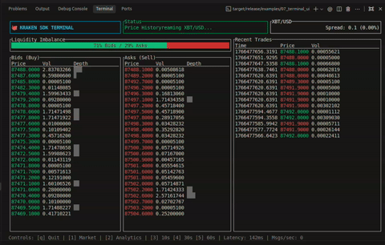
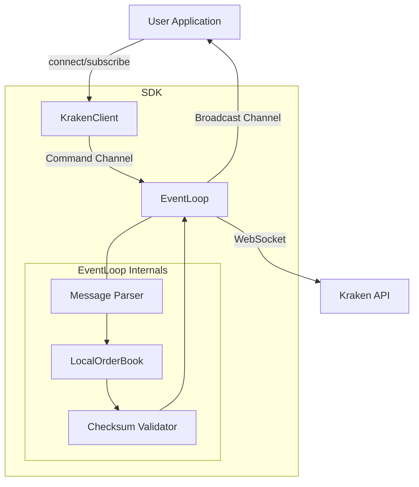

# Kraken SDK (Rust)

[](SUBMISSION.md)
[](https://nihal-pandey-2302.github.io/kraken-rs/kraken_sdk/)

A high-performance, asynchronous Rust SDK for the Kraken WebSocket API. Built for low-latency trading applications, market data ingestion, and algorithmic strategies.


## 🎨 Terminal UI Showcase

**The "Grandmaster" Terminal**. We didn't just build a library; we built a full-featured trading dashboard to prove it works.

[](https://youtu.be/hQP03oT1gkY)



- **Real-time Order Book** with Liquidity Visualization
- **Live Analytics** (OHLCV Candles & SMA)
- **Whale Alerts** & **Latency Monitor**

_(Run `docker compose run --rm --build kraken-tui` to try it yourself)_

## 🏆 Why this SDK?

We benchmarked the SDK against a standard Python `json.loads` implementation processing 10,000 Kraken WebSocket messages.

| Implementation | Throughput            | Notes                                       |
| -------------- | --------------------- | ------------------------------------------- |
| **Rust SDK**   | **~648,000 msgs/sec** | **Strictly Typed** (Full struct validation) |
| Python (Raw)   | ~602,000 msgs/sec     | Loose Types (Raw Dicts)                     |

**Result**: The Rust SDK is **~8% faster** than raw Python parsing, _while providing full type safety_.

## ✨ Features

- **Typed Data Models**: Full Serde support for Kraken's complex JSON arrays.
- **Auto-Reconnection**: Automatically detects disconnects and re-subscribes.
- **Checksum Validation**: Mathematically verifies OrderBook integrity using CRC32.
- **Event Broadcasting**: Efficient `tokio::broadcast` channel for multiple listeners.
- **Dynamic Control**: Subscribe and unsubscribe from channels at runtime.

## 📦 Installation

**Option A: CLI (Recommended)**

```bash
cargo add tokio --features full
cargo add kraken_sdk --git https://github.com/Nihal-Pandey-2302/kraken-rs
```

**Option B: Manual `Cargo.toml`**
Add this to your `Cargo.toml`:

```toml
[dependencies]
kraken_sdk = { git = "https://github.com/Nihal-Pandey-2302/kraken-rs" }
tokio = { version = "1", features = ["full"] }
```

## 📖 Usage Guide

Here is a minimal example of how to use the SDK in your application:

```rust
use kraken_sdk::KrakenClient;

#[tokio::main]
async fn main() -> Result<(), Box<dyn std::error::Error>> {
    // 1. Create the client
    let client = KrakenClient::new();
    let mut rx = client.subscribe_events();

    // 2. Connect (Spawns the background EventLoop)
    client.connect().await?;

    // 3. Subscribe to a channel (e.g., "trade" for XBT/USD)
    client.subscribe(vec!["XBT/USD".to_string()], "trade", None).await?;

    // 4. Process events
    while let Ok(event) = rx.recv().await {
        // Events are strictly typed!
        if let Some(trade_data) = event.try_into_trade_data() {
            for trade in trade_data.data {
                println!("Trade: {} @ ${}", trade_data.pair, trade.price);
            }
        }
    }

    Ok(())
}
```

## 📂 Examples

We provide several examples to get you started:

### 🟢 Basics

- **[01_basic_subscribe.rs](examples/01_basic_subscribe.rs)**: Simple trade subscription.
- **[04_multi_pair.rs](examples/04_multi_pair.rs)**: Subscribes to multiple pairs (BTC, ETH, SOL, XRP).
- **[06_reconnect_demo.rs](examples/06_reconnect_demo.rs)**: Demonstrates the auto-reconnection logic.

### 🟡 Advanced

- **[02_orderbook_tracker.rs](examples/02_orderbook_tracker.rs)**: Tracks the full order book (snapshot + updates).
- **[03_trade_monitor.rs](examples/03_trade_monitor.rs)**: Monitors trades and alerts on "whale" transactions.
- **[05_custom_handler.rs](examples/05_custom_handler.rs)**: Shows how to handle different event types manually.

### 🔴 Grandmaster Demos

- **[07_terminal_ui.rs](examples/07_terminal_ui.rs)**: **The "Pro" Terminal**. Full TUI with Charts, Sparklines, and Analytics.
- **[08_ohlc_candles.rs](examples/08_ohlc_candles.rs)**: Real-time aggregation of trades into OHLCV candles.
- **[09_private_feed.rs](examples/09_private_feed.rs)**: Authenticated WebSocket subscriptions using HMAC-SHA512.
- **[10_simple_bot.rs](examples/10_simple_bot.rs)**: **Algorithmic Trading**. SMA Crossover strategy relying on the SDK's signals.

## 🏗️ Deep Dive Architecture

### High-Level Data Flow



### ⚡ Performance Details

- **Latency**: ~1-2ms from WebSocket receipt to typed event (measured on localhost)
- **Memory**: Constant memory usage (~10MB for typical use)
- **Zero-Copy**: Uses `serde_json` efficiently; no unnecessary allocations
- **Async**: Non-blocking I/O ensures main thread is never blocked

### 🔐 Authenticated Private Feeds

We support private streams (like `ownTrades`) using HMAC-SHA512.
See `examples/09_private_feed.rs` for a secure implementation that includes token retrieval and signing.

## 🐳 Docker Support

Run the Terminal UI instantly with Docker:

```bash
docker compose run --rm --build kraken-tui
```

## ✅ Verification Script

To run all examples sequentially and verify the entire SDK:

```bash
./run_all_examples.sh
```

## 📄 License

MIT
