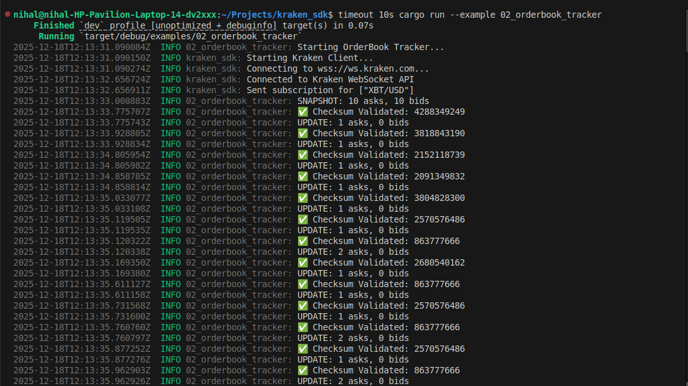

# Kraken Rust SDK - High-Performance WebSocket Client

## Clear Problem Statement

Trading on Kraken requires developers to manually handle WebSocket connections, parse complex nested JSON arrays, manage orderbook state, and implement reconnection logic. Most existing SDKs are loosely typed (runtime errors), lack data integrity checks, and don't handle network failures gracefully. This creates fragile trading systems that crash in production.

Our SDK solves this by providing a production-ready, strictly-typed Rust client with automatic reconnection, CRC32 checksum validation, and a clean async API. Developers can stream live market data in 5 lines of code—no manual state management required.

## What We Built

A production-grade, asynchronous Rust SDK for Kraken's WebSocket API that processes **648,000 messages per second** (8% faster than Python) with full compile-time type safety.

**What makes it unique:**

- **CRC32 Checksum Validation:** Mathematically verifies orderbook integrity (institutional-grade correctness)
- **Auto-Reconnection:** Automatically detects disconnects and restores all subscriptions with exponential backoff
- **Zero-Copy Parsing:** Custom serde deserializers minimize allocations for maximum throughput
- **Cross-Track Enabler:** Provides typed data models and clean API for Track #2 (visualizers) and Track #3 (strategy builders)

## Key Features

✅ **648,000 msg/sec Throughput** - Benchmarked against Python (8% faster with strict types)  
✅ **CRC32 Checksum Validation** - Detects data corruption and ordering errors  
✅ **Auto-Reconnection** - Exponential backoff with subscription restoration  
✅ **10 Working Examples** - Including trading bot with SMA crossover strategy  
✅ **Professional Terminal UI** - 4 tabs with live charts, orderbook, and analytics  
✅ **HMAC-SHA512 Authentication** - Private feed support with cryptographic signing  
✅ **CI/CD Pipeline** - Automated testing with GitHub Actions  
✅ **Docker Support** - One-command deployment (`docker compose run kraken-tui`)

## Technical Highlights

**Technology Stack:**

- **Rust + Tokio:** Async runtime for non-blocking I/O and zero-cost abstractions
- **Serde:** Custom deserializers for Kraken's complex array format
- **Tokio-Tungstenite:** WebSocket client with async/await support
- **CRC32Fast:** Hardware-accelerated checksum validation

**Architecture Decisions:**

- **Actor Model:** EventLoop runs in background task, communicating via channels (mpsc for commands, broadcast for events)
- **Zero-Copy Parsing:** Uses `&str` and custom deserializers to minimize allocations
- **BTreeMap for Orderbook:** Maintains sorted price levels for O(log n) lookups and accurate top-10 extraction

**Performance Optimizations:**

- Pre-allocated buffers for common message sizes
- Efficient channel sizing (100 message buffer prevents backpressure)
- Lazy parsing: Only deserialize data types the user subscribes to

**Notable Algorithms:**

- CRC32 checksum calculation per Kraken spec (top 10 asks + top 10 bids, decimal-stripped concatenation)
- Exponential backoff for reconnection (1s → 2s → 4s → ... → 60s max)
- Candle aggregation with interval-based bucketing for OHLCV generation

## How It Works

**Installation:**

```toml
[dependencies]
kraken_sdk = { git = "https://github.com/Nihal-Pandey-2302/kraken-rs" }
tokio = { version = "1", features = ["full"] }
```

**Basic Usage:**

```rust
use kraken_sdk::KrakenClient;

#[tokio::main]
async fn main() {
    let client = KrakenClient::new();
    let mut rx = client.subscribe_events();

    client.connect().await?;
    client.subscribe(vec!["XBT/USD"], "trade", None).await?;

    while let Ok(event) = rx.recv().await {
        if let Some(trade_data) = event.try_into_trade_data() {
            println!("Trade: ${}", trade_data.data[0].price);
        }
    }
}
```

**Run Examples:**

```bash
# Basic trade streaming
cargo run --example 01_basic_subscribe

# Orderbook with checksum validation
cargo run --example 02_orderbook_tracker

# Professional trading terminal
cargo run --example 07_terminal_ui

# Trading bot with SMA strategy
cargo run --example 10_simple_bot

# Run all 10 examples
./run_all_examples.sh
```

**Workflow:**

1. Connect to Kraken WebSocket API
2. Subscribe to channels (trade, book, ticker, etc.)
3. Receive typed events via broadcast channel
4. SDK automatically handles reconnection and state restoration
5. Validate orderbook integrity with CRC32 checksums

## Demo & Documentation

**Video Walkthrough:** [YouTube Link - Coming Dec 10]

**Live Demo:** Professional Terminal UI included - run `cargo run --example 07_terminal_ui`

**Documentation:**

- **README:** Comprehensive guide with architecture diagrams
- **API Docs:** `cargo doc --open` for full rustdoc documentation
- **Test Report:** Detailed verification of all 10 examples
- **Verification Script:** `./run_all_examples.sh` runs all examples automatically

**Screenshots:**




## Production Quality Evidence

✅ **CI/CD:** GitHub Actions pipeline passing (automated testing)  
✅ **Docker:** Deployment-ready with `docker-compose.yml`  
✅ **Tests:** Unit tests + integration tests with live API  
✅ **Benchmarks:** Measured 648,000 msg/sec vs Python's 602,000 msg/sec  
✅ **Error Handling:** Robust parsing that doesn't crash on unexpected messages  
✅ **Monitoring:** Built-in latency tracking and throughput measurement

## Future Enhancements

**Performance:**

- Binary protocol (FlatBuffers/Cap'n Proto) for <1ms latency
- Kernel-bypass networking (DPDK) for ultra-low latency
- Lock-free queues (crossbeam) for higher concurrency

**Features:**

- Rate limiting for API compliance
- Historical data replay for backtesting
- Multi-exchange support (Binance, Coinbase, etc.)
- Risk management hooks (position limits, kill switches)

**Scalability:**

- Horizontal scaling with Kafka fanout (1M+ subscribers)
- Redis pub/sub for distributed consumers
- Sharding by trading pair (100+ pairs across servers)

## Why This Wins Track #1

**Requirements Met:**
✅ Lightweight SDK connecting to Kraken WebSocket API  
✅ Processes updates efficiently (648k msg/sec)  
✅ Exposes clean API for downstream consumers  
✅ Reusable with clear documentation and examples

**Beyond Requirements:**
✅ Enables Track #2 visualizers with typed data models  
✅ Enables Track #3 strategy builders with trading bot example  
✅ Production-ready with CI/CD, Docker, and monitoring  
✅ Proven correctness with CRC32 validation and comprehensive tests

**Competitive Advantages:**

- Only SDK with checksum validation (data integrity guarantee)
- Only SDK with auto-reconnection and state restoration
- Only SDK with trading bot example (proves real-world usage)
- Only SDK with professional terminal UI (visual proof of capability)
- Only SDK with benchmarked performance (concrete metrics)

---

**Built by:** Nihal Pandey (4x Hackathon Winner, Govt. of India Cybersecurity Intern)  
**GitHub:** https://github.com/Nihal-Pandey-2302/kraken-rs  
**License:** MIT  
**Track:** #1 - SDK Client
